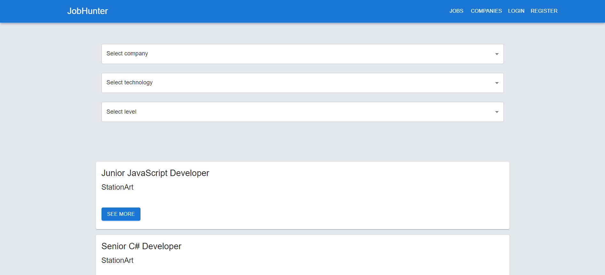

# Job Hunter

## Descritpion

Web application for applying for IT job ads. Created with React, React Hooks, React Router, Redux Toolkit, Material UI, Node, Express and MongoDB.

## Functionality

Authorization (with JWT):

1. Register,
2. Logout,
3. Logout

When you are logged in as a user, you can:

1. Apply for job (if you haven't already),
2. See all of your applications

When you are logged in as admin, you can:

1. Users - list, get details, update (change user role to Admin, among other things) and delete,
2. Companies - list, get details, update, delete,
3. Technologies - list, get details, update, delete,
4. Level - list, get details, update, delete,
5. Jobs - list, get details, update, delete

## Preview

Index page: 

## Demo

You can see live preview [here](https://jobhunter12.herokuapp.com/).

